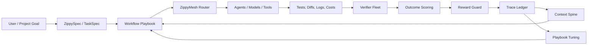

# Adaptive Workflow Learning, Context Spine, and Trace Ledger

Status: proposed
Owner: product-architecture
Created: 2026-06-30

## Summary

AutoClaw should turn recent model and reinforcement-learning lessons into a
product-safe middleware architecture, not a copied model brand or research
codename. The immediate goal is to make AutoClaw better at choosing, tuning,
verifying, and learning from workflow playbooks while preserving local-first
ownership and provider neutrality.

This spec supersedes public-facing references to the legacy "OSL" initiative.
The old names remain in historical task IDs and research notes only. Product
language follows [AutoClaw Naming Guide](../../BRAND_NAMING_GUIDE.md).

## Product Vocabulary

| Product term | Meaning |
|---|---|
| Adaptive Workflow Learning | AutoClaw's outcome-driven workflow improvement loop. |
| Workflow Playbook | A reusable strategy for a task/run, including routing, context, tool lanes, loop policy, and review policy. |
| Playbook Tuning | Bounded generation of child playbook variants. |
| Outcome Scoring | Reward rows derived from tests, reviews, cost, time, failures, and policy violations. |
| Reward Guard | Deterministic anti-gaming and scope/policy boundary checks. |
| Context Spine | Hierarchical index over project, task, run, file, symbol, and span context. |
| Trace Ledger | Verified episode ledger used for replay, benchmarking, distillation, and research export. |
| Verifier Fleet | Automated local/remote reviewers that produce gated verdicts and reward signals. |
| ZippyMesh Router | Model/tool/provider routing surface. |

## Goals

- Use hierarchical and streaming-aware context indexing at the middleware layer.
- Record verified traces that can later train or distill small AutoClaw-aware
  models.
- Let Workflow Playbooks mutate, run, verify, score, and improve without
  widening scope or bypassing policy.
- Make ZippyMesh Router and Verifier Fleet consume the same Context Spine and
  Trace Ledger evidence.
- Keep all research and third-party model names out of product feature names.

## Non-Goals

- Training a large foundation model in this phase.
- Copying any third-party architecture, codebase, model name, or marketing
  language into Zippy product names.
- Centralizing all routing inside AutoClaw when ZippyMesh Router already owns
  model routing.
- Storing hidden chain-of-thought. The Trace Ledger records observable actions,
  concise rationales, diffs, tests, verdicts, and outcomes.

## Architecture

## Context Spine

The Context Spine is a hierarchical index with stable IDs:

- `project`: repo, workspace, branch, high-level docs.
- `spec`: task specs, acceptance criteria, VoidSpec/ZippySpec inputs.
- `run`: claims, messages, gate results, review verdicts.
- `file`: path-level file summaries and ownership.
- `symbol`: function/class/export-level references.
- `span`: exact line/chunk snippets for prompts.

The spine should support coarse-to-fine retrieval: choose project/spec/run/file
blocks first, then choose symbols/spans. This mirrors the practical lesson from
sparse/hierarchical attention research without taking a research method name as
our product name.

### CS-1 Implementation Contract

- Stable block IDs use `ctx:<project>:<level>:<key>[:version]` and normalize
  slashes, casing, and unsafe characters.
- `src/intelligence/contextSpine.ts` owns the schema, sanitization, scoring, and
  coarse-to-fine reference selection.
- `src/intelligence/contextIndex.ts` owns the local JSONL store at
  `.autoclaw/intelligence/context-spine/blocks.jsonl`.
- Reads collapse append-only rows by latest record ID, skip malformed lines with
  warnings, and return empty degraded results when no store exists.
- Public retrieval APIs return `ContextBlockRef` values first. Snippets may be
  kept on records for bounded file/spec context, but they are not exposed in the
  reference result path.
- Prompt-like metadata keys such as `prompt`, `rawPrompt`, `messages`,
  `response`, and hidden chain-of-thought variants are stripped before storage.

## Trace Ledger

The Trace Ledger records verified episodes:

- `task_id`, `run_id`, `session_id`, `agent_id`
- selected Workflow Playbook and child variant
- selected model/provider/harness
- context block IDs used
- tool calls and command gates
- changed files and diff summary
- tests and verifier verdicts
- reward/outcome score
- cost, duration, retry/rework count
- Reward Guard findings

Trace rows must avoid prompt/response body storage by default. They should be
exportable for evaluation and opt-in distillation datasets.

## Workflow Playbook Loop

The first full loop is:

1. Select a Workflow Playbook from task intent, constraints, history, and
   available models/tools.
2. Build context from the Context Spine.
3. Route model/tool execution through ZippyMesh Router and AutoClaw runners.
4. Verify with command gates and Verifier Fleet.
5. Score the run using Outcome Scoring.
6. Pass all evidence through Reward Guard.
7. Append a Trace Ledger row.
8. Tune a bounded child playbook when improvement is justified.

## Naming And Branding Requirements

- Public docs and commands use approved terms from the naming guide.
- Legacy "OSL" appears only in historical IDs, migration notes, and code that
  has not yet been safely renamed.
- Provider/model names are labels, not AutoClaw feature names.
- "VoidSpec" should be treated as legacy/external until the canonical task spec
  name is decided. New public material should prefer ZippySpec or TaskSpec.

## Commercial Packaging

Core/free:

- Local Context Spine basics.
- Local Trace Ledger.
- Manual Workflow Playbooks.
- Local/free Verifier Fleet reviews.

Pro:

- Always-on Playbook Tuning.
- Advanced Context Spine modes.
- Model canary benchmarks.
- Automated Verifier Fleet escalation.
- Dataset export for distillation.

Teams:

- Shared Trace Ledger.
- Cross-agent Context Spine sharing.
- Org chart/sub-orchestrator policies.
- Team verifier governance and audit trails.

Enterprise/Hosted:

- Managed relay, vector/KG backend, private model endpoints, retention, SSO,
  compliance export, and private model training support.

## First Milestones

1. Naming and migration guide.
2. Context Spine contracts and store.
3. Context Pack v2 modes.
4. Trace Ledger schema and writers.
5. Playbook Experiment Runner.
6. Model Canary Benchmark harness.
7. Verifier Fleet reward integration.
8. ZippySpec task contract cleanup.
